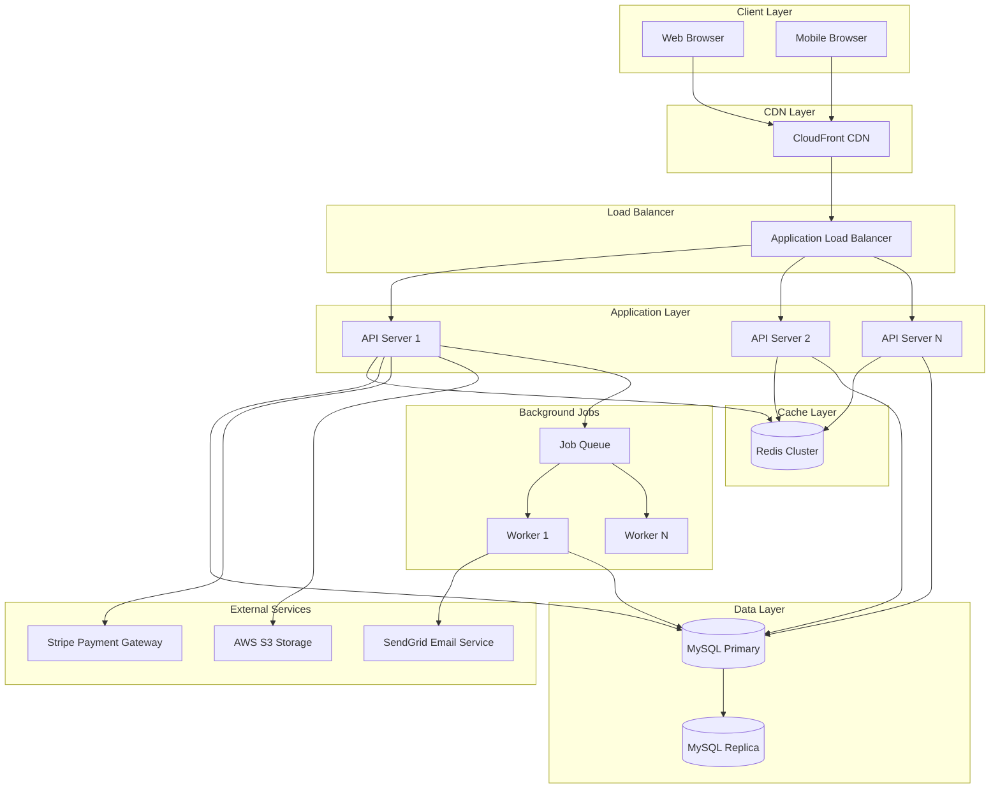
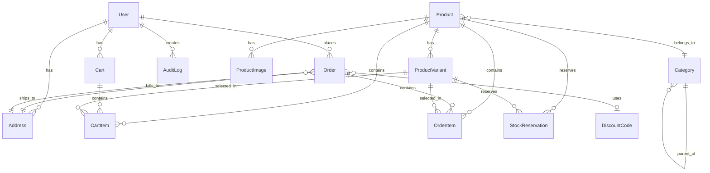

# Design Document: E-Commerce Platform

## Overview

The e-commerce platform is designed as a modern, scalable web application following a three-tier architecture: presentation layer (React SPA), application layer (RESTful API), and data layer (MySQL with Redis caching). The system emphasizes security, performance, and maintainability through clear separation of concerns, stateless API design, and comprehensive testing strategies.

### Key Design Principles

1. **Stateless API Design**: All application servers are stateless, storing session data in Redis for horizontal scalability
2. **Defense in Depth**: Multiple security layers including input validation, authentication, authorization, and encryption
3. **Fail-Safe Defaults**: Secure defaults with explicit opt-in for privileged operations
4. **Idempotency**: Critical operations (payment, order creation) are idempotent to handle retries safely
5. **Event-Driven Architecture**: Asynchronous processing for notifications, inventory updates, and analytics
6. **Optimistic Concurrency**: Version-based conflict detection for inventory and cart operations

### Technology Stack

- **Frontend**: React 18+ with JavaScript (ES6+), Redux for state management, React Router for navigation
- **Backend**: Node.js with Express.js, JavaScript (ES6+)
- **Database**: MySQL 8.0+ for relational data, Redis 7+ for caching and sessions
- **Authentication**: JWT tokens with refresh token rotation
- **Payment**: Stripe API for payment processing
- **Email**: SendGrid for transactional emails
- **File Storage**: AWS S3 for product images
- **Monitoring**: Prometheus for metrics, Grafana for visualization, Sentry for error tracking
- **Testing**: Jest for unit tests, Supertest for API tests, fast-check for property-based testing

## Architecture

### System Architecture Diagram



### Request Flow

1. **Client Request**: Browser sends HTTPS request to CDN
2. **CDN**: Serves static assets (HTML, CSS, JS, images) from edge locations
3. **Load Balancer**: Routes API requests to healthy application servers using round-robin
4. **API Server**: 
   - Validates JWT token from Redis session store
   - Checks authorization based on user role
   - Queries MySQL for data or checks Redis cache
   - Processes business logic
   - Returns JSON response
5. **Background Jobs**: Asynchronous tasks (emails, analytics) are queued and processed by workers

### Data Flow for Critical Operations

**Checkout and Payment Flow**:
```
1. Customer initiates checkout
2. API validates cart items and stock availability
3. API creates stock reservations (15-minute TTL)
4. Customer submits payment
5. API sends payment request to Stripe
6. Stripe processes payment and returns result
7. On success: API creates order, deducts inventory, queues confirmation email
8. On failure: API releases reservations, returns error to customer
```

## Components and Interfaces

### Frontend Components

#### 1. Authentication Module
- **LoginForm**: Handles user login with email/password
- **RegisterForm**: User registration with validation
- **PasswordResetForm**: Password reset request and confirmation
- **AuthContext**: React context for authentication state management
- **ProtectedRoute**: Route wrapper that enforces authentication

#### 2. Product Catalog Module
- **ProductList**: Displays paginated product grid with filtering
- **ProductCard**: Individual product preview with image, price, rating
- **ProductDetail**: Full product page with variants, description, reviews
- **CategoryNav**: Hierarchical category navigation
- **SearchBar**: Search input with autocomplete suggestions
- **FilterPanel**: Multi-select filters for category, price, brand, rating

#### 3. Shopping Cart Module
- **CartIcon**: Header icon showing cart item count
- **CartDrawer**: Slide-out panel with cart summary
- **CartPage**: Full cart page with item management
- **CartItem**: Individual cart item with quantity controls
- **CartContext**: React context for cart state management

#### 4. Checkout Module
- **CheckoutStepper**: Multi-step checkout wizard
- **ShippingAddressForm**: Address selection and entry
- **ShippingMethodSelector**: Shipping option selection
- **PaymentForm**: Payment method and card details
- **OrderSummary**: Final order review before submission
- **OrderConfirmation**: Post-purchase confirmation page

#### 5. Order Management Module
- **OrderHistory**: List of customer's past orders
- **OrderDetail**: Detailed view of single order with tracking
- **OrderTracking**: Visual shipment tracking timeline

#### 6. Admin Dashboard Module
- **AdminLayout**: Admin-specific layout with navigation
- **ProductManagement**: CRUD interface for products
- **OrderManagement**: Order list with status updates
- **InventoryManagement**: Stock level monitoring and updates
- **UserManagement**: User list and role management
- **AnalyticsDashboard**: Sales and performance metrics

### Backend API Endpoints

#### Authentication API (`/api/v1/auth`)
```javascript
POST   /register          - Create new user account
POST   /login             - Authenticate user and return JWT
POST   /logout            - Invalidate session token
POST   /refresh           - Refresh access token using refresh token
POST   /password-reset    - Request password reset email
POST   /password-reset/:token - Confirm password reset with new password
GET    /verify-email/:token - Verify email address
```

#### User API (`/api/v1/users`)
```javascript
GET    /me                - Get current user profile
PUT    /me                - Update current user profile
DELETE /me                - Delete user account (soft delete)
GET    /me/addresses      - Get user's shipping addresses
POST   /me/addresses      - Add new shipping address
PUT    /me/addresses/:id  - Update shipping address
DELETE /me/addresses/:id  - Delete shipping address
GET    /me/orders         - Get user's order history
```

#### Product API (`/api/v1/products`)
```javascript
GET    /                  - List products with pagination and filters
GET    /:id               - Get product details
GET    /search            - Search products with autocomplete
GET    /categories        - Get category hierarchy
GET    /categories/:id/products - Get products in category
```

#### Cart API (`/api/v1/cart`)
```javascript
GET    /                  - Get current cart
POST   /items             - Add item to cart
PUT    /items/:id         - Update cart item quantity
DELETE /items/:id         - Remove item from cart
DELETE /                  - Clear entire cart
POST   /validate          - Validate cart items and stock availability
```

#### Checkout API (`/api/v1/checkout`)
```javascript
POST   /                  - Initiate checkout and create stock reservations
POST   /apply-discount    - Apply discount code to cart
POST   /calculate-shipping - Calculate shipping cost for address
POST   /payment           - Process payment and create order
```

#### Order API (`/api/v1/orders`)
```javascript
GET    /:id               - Get order details
POST   /:id/cancel        - Cancel order (if eligible)
POST   /:id/reorder       - Add order items to cart
GET    /:id/tracking      - Get shipment tracking information
```

#### Admin Product API (`/api/v1/admin/products`)
```javascript
POST   /                  - Create new product
PUT    /:id               - Update product
DELETE /:id               - Delete product (soft delete)
POST   /:id/images        - Upload product image
DELETE /:id/images/:imageId - Delete product image
PUT    /:id/inventory     - Update inventory quantity
```

#### Admin Order API (`/api/v1/admin/orders`)
```javascript
GET    /                  - List all orders with filters
PUT    /:id/status        - Update order status
POST   /:id/refund        - Process refund
PUT    /:id/tracking      - Update tracking information
```

#### Admin User API (`/api/v1/admin/users`)
```javascript
GET    /                  - List all users with filters
GET    /:id               - Get user details
PUT    /:id/role          - Update user role
PUT    /:id/status        - Activate/deactivate user account
```

#### Admin Discount API (`/api/v1/admin/discounts`)
```javascript
GET    /                  - List all discount codes
POST   /                  - Create discount code
PUT    /:id               - Update discount code
DELETE /:id               - Delete discount code
GET    /:id/usage         - Get discount usage statistics
```

### Service Layer Components

#### 1. AuthService
**Responsibilities**: User authentication, session management, password hashing
```javascript
/**
 * @typedef {Object} AuthService
 * @property {function(string, string, string): Promise<User>} register - Create new user account
 * @property {function(string, string): Promise<{accessToken: string, refreshToken: string}>} login - Authenticate user
 * @property {function(string): Promise<void>} logout - Invalidate session
 * @property {function(string): Promise<{accessToken: string}>} refreshToken - Refresh access token
 * @property {function(string): Promise<void>} requestPasswordReset - Request password reset email
 * @property {function(string, string): Promise<void>} resetPassword - Reset password with token
 * @property {function(string): Promise<void>} verifyEmail - Verify email address
 * @property {function(string): Promise<string>} hashPassword - Hash password with bcrypt
 * @property {function(string, string): Promise<boolean>} verifyPassword - Verify password against hash
 */
```

#### 2. ProductService
**Responsibilities**: Product catalog management, search, filtering
```javascript
/**
 * @typedef {Object} ProductService
 * @property {function(ProductFilters, Pagination): Promise<ProductPage>} listProducts - List products with filters
 * @property {function(string): Promise<Product>} getProduct - Get product by ID
 * @property {function(string, ProductFilters): Promise<Product[]>} searchProducts - Search products
 * @property {function(string): Promise<string[]>} getAutocomplete - Get autocomplete suggestions
 * @property {function(): Promise<Category[]>} getCategories - Get category hierarchy
 * @property {function(string): Promise<Product[]>} getCategoryProducts - Get products in category
 * @property {function(CreateProductDto): Promise<Product>} createProduct - Create new product
 * @property {function(string, UpdateProductDto): Promise<Product>} updateProduct - Update product
 * @property {function(string): Promise<void>} deleteProduct - Delete product (soft delete)
 */
```

#### 3. CartService
**Responsibilities**: Shopping cart operations, validation
```javascript
/**
 * @typedef {Object} CartService
 * @property {function(string): Promise<Cart>} getCart - Get user's cart
 * @property {function(string, string, string, number): Promise<Cart>} addItem - Add item to cart
 * @property {function(string, string, number): Promise<Cart>} updateItemQuantity - Update item quantity
 * @property {function(string, string): Promise<Cart>} removeItem - Remove item from cart
 * @property {function(string): Promise<void>} clearCart - Clear entire cart
 * @property {function(string): Promise<CartValidation>} validateCart - Validate cart items
 * @property {function(Cart): Promise<CartTotal>} calculateTotal - Calculate cart total
 */
```

#### 4. CheckoutService
**Responsibilities**: Checkout process, stock reservations, order creation
```javascript
/**
 * @typedef {Object} CheckoutService
 * @property {function(string): Promise<CheckoutSession>} initiateCheckout - Start checkout process
 * @property {function(string, string): Promise<CheckoutSession>} applyDiscount - Apply discount code
 * @property {function(string, string, ShippingMethod): Promise<ShippingCost>} calculateShipping - Calculate shipping cost
 * @property {function(string, PaymentMethod): Promise<Order>} processPayment - Process payment and create order
 * @property {function(CartItem[]): Promise<Reservation[]>} createStockReservations - Create stock reservations
 * @property {function(string[]): Promise<void>} releaseReservations - Release stock reservations
 */
```

#### 5. OrderService
**Responsibilities**: Order management, status updates, cancellations
```javascript
/**
 * @typedef {Object} OrderService
 * @property {function(string): Promise<Order>} getOrder - Get order by ID
 * @property {function(string, Pagination): Promise<OrderPage>} getUserOrders - Get user's orders
 * @property {function(string, string): Promise<Order>} cancelOrder - Cancel order
 * @property {function(string, string): Promise<Cart>} reorder - Reorder items from past order
 * @property {function(string, OrderStatus): Promise<Order>} updateOrderStatus - Update order status
 * @property {function(string, TrackingInfo): Promise<Order>} updateTracking - Update tracking info
 * @property {function(string): Promise<Order>} processRefund - Process refund
 */
```

#### 6. InventoryService
**Responsibilities**: Stock management, reservations, alerts
```javascript
/**
 * @typedef {Object} InventoryService
 * @property {function(string, string=): Promise<number>} getStock - Get stock quantity
 * @property {function(string, string, number): Promise<void>} updateStock - Update stock quantity
 * @property {function(CartItem[], number): Promise<Reservation[]>} reserveStock - Reserve stock for checkout
 * @property {function(string): Promise<void>} releaseReservation - Release stock reservation
 * @property {function(OrderItem[]): Promise<void>} deductStock - Deduct stock for order
 * @property {function(OrderItem[]): Promise<void>} restoreStock - Restore stock on cancellation
 * @property {function(): Promise<LowStockAlert[]>} checkLowStock - Check for low stock items
 */
```

#### 7. PaymentService
**Responsibilities**: Payment processing integration with Stripe
```javascript
/**
 * @typedef {Object} PaymentService
 * @property {function(number, string): Promise<PaymentIntent>} createPaymentIntent - Create payment intent
 * @property {function(string, PaymentMethod): Promise<PaymentResult>} confirmPayment - Confirm payment
 * @property {function(string, number): Promise<Refund>} processRefund - Process refund
 * @property {function(string): Promise<PaymentStatus>} getPaymentStatus - Get payment status
 */
```

#### 8. NotificationService
**Responsibilities**: Email notifications, queuing
```javascript
/**
 * @typedef {Object} NotificationService
 * @property {function(Order): Promise<void>} sendOrderConfirmation - Send order confirmation email
 * @property {function(Order, TrackingInfo): Promise<void>} sendShippingNotification - Send shipping notification
 * @property {function(Order): Promise<void>} sendDeliveryConfirmation - Send delivery confirmation
 * @property {function(string, string): Promise<void>} sendPasswordReset - Send password reset email
 * @property {function(string, string): Promise<void>} sendEmailVerification - Send email verification
 * @property {function(Product, number): Promise<void>} sendLowStockAlert - Send low stock alert
 */
```

## Data Models

### User Model
```javascript
/**
 * @typedef {Object} User
 * @property {string} id - UUID
 * @property {string} email - Unique, indexed
 * @property {string} passwordHash - bcrypt hash
 * @property {string} name
 * @property {'customer'|'admin'} role
 * @property {boolean} emailVerified
 * @property {number} failedLoginAttempts
 * @property {Date|null} accountLockedUntil
 * @property {Date} createdAt
 * @property {Date} updatedAt
 * @property {Date|null} deletedAt - Soft delete
 */
```

### Product Model
```javascript
/**
 * @typedef {Object} Product
 * @property {string} id - UUID
 * @property {string} name - Indexed for search
 * @property {string} description
 * @property {number} basePrice - In cents
 * @property {string} categoryId - Foreign key
 * @property {string} brand
 * @property {ProductImage[]} images
 * @property {ProductVariant[]} variants
 * @property {number} averageRating
 * @property {number} reviewCount
 * @property {boolean} isActive
 * @property {Date} createdAt
 * @property {Date} updatedAt
 * @property {Date|null} deletedAt
 */

/**
 * @typedef {Object} ProductImage
 * @property {string} id
 * @property {string} productId
 * @property {string} url - S3 URL
 * @property {string} altText
 * @property {number} sortOrder
 */

/**
 * @typedef {Object} ProductVariant
 * @property {string} id
 * @property {string} productId
 * @property {string} sku - Unique
 * @property {string} name - e.g., "Large / Red"
 * @property {number} priceAdjustment - In cents, added to basePrice
 * @property {number} stockQuantity
 * @property {Object.<string, string>} attributes - e.g., { size: "L", color: "Red" }
 */
```

### Category Model
```javascript
/**
 * @typedef {Object} Category
 * @property {string} id
 * @property {string} name
 * @property {string} slug - URL-friendly, unique
 * @property {string|null} parentId - Self-referential for hierarchy
 * @property {string} description
 * @property {number} sortOrder
 * @property {boolean} isActive
 */
```

### Cart Model
```javascript
/**
 * @typedef {Object} Cart
 * @property {string} id
 * @property {string} userId - Foreign key, indexed
 * @property {CartItem[]} items
 * @property {Date} createdAt
 * @property {Date} updatedAt
 * @property {Date} expiresAt - 30 days from last update
 */

/**
 * @typedef {Object} CartItem
 * @property {string} id
 * @property {string} cartId
 * @property {string} productId
 * @property {string} variantId
 * @property {number} quantity
 * @property {number} priceAtAdd - Snapshot of price when added
 * @property {Date} addedAt
 */
```

### Order Model
```javascript
/**
 * @typedef {Object} Order
 * @property {string} id
 * @property {string} orderNumber - Human-readable, unique
 * @property {string} userId - Foreign key
 * @property {OrderStatus} status
 * @property {OrderItem[]} items
 * @property {number} subtotal - In cents
 * @property {number} discountAmount - In cents
 * @property {number} shippingCost - In cents
 * @property {number} taxAmount - In cents
 * @property {number} total - In cents
 * @property {Address} shippingAddress
 * @property {Address} billingAddress
 * @property {ShippingMethod} shippingMethod
 * @property {PaymentMethod} paymentMethod
 * @property {string} paymentIntentId - Stripe payment intent ID
 * @property {string|null} discountCode
 * @property {string|null} trackingNumber
 * @property {string|null} trackingUrl
 * @property {string|null} notes
 * @property {Date} createdAt
 * @property {Date} updatedAt
 */

/**
 * @typedef {'pending'|'processing'|'shipped'|'delivered'|'cancelled'|'refunded'} OrderStatus
 */

/**
 * @typedef {Object} OrderItem
 * @property {string} id
 * @property {string} orderId
 * @property {string} productId
 * @property {string} variantId
 * @property {string} productName - Snapshot
 * @property {string} variantName - Snapshot
 * @property {number} quantity
 * @property {number} pricePerUnit - In cents, snapshot
 * @property {number} subtotal - In cents
 */
```

### Address Model
```javascript
/**
 * @typedef {Object} Address
 * @property {string} id
 * @property {string} userId
 * @property {string} fullName
 * @property {string} addressLine1
 * @property {string|null} addressLine2
 * @property {string} city
 * @property {string} state
 * @property {string} postalCode
 * @property {string} country
 * @property {string} phoneNumber
 * @property {boolean} isDefault
 * @property {Date} createdAt
 * @property {Date} updatedAt
 */
```

### Discount Code Model
```javascript
/**
 * @typedef {Object} DiscountCode
 * @property {string} id
 * @property {string} code - Unique, case-insensitive
 * @property {'percentage'|'fixed'} type
 * @property {number} value - Percentage (0-100) or cents
 * @property {number|null} minimumOrderValue - In cents
 * @property {number|null} maxUsageCount
 * @property {number} currentUsageCount
 * @property {Date} expiresAt
 * @property {boolean} isActive
 * @property {Date} createdAt
 * @property {Date} updatedAt
 */
```

### Stock Reservation Model
```javascript
/**
 * @typedef {Object} StockReservation
 * @property {string} id
 * @property {string} productId
 * @property {string} variantId
 * @property {number} quantity
 * @property {string} userId
 * @property {string} checkoutSessionId
 * @property {Date} expiresAt - 15 minutes from creation
 * @property {Date} createdAt
 */
```

### Session Model (Redis)
```javascript
/**
 * @typedef {Object} Session
 * @property {string} sessionId - JWT token ID
 * @property {string} userId
 * @property {string} role
 * @property {number} expiresAt - Unix timestamp
 * @property {string} refreshToken
 */
```

### Audit Log Model
```javascript
/**
 * @typedef {Object} AuditLog
 * @property {string} id
 * @property {string} userId
 * @property {string} action - e.g., "UPDATE_PRODUCT", "CHANGE_ORDER_STATUS"
 * @property {string} entityType - e.g., "Product", "Order"
 * @property {string} entityId
 * @property {Object.<string, any>} changes - JSON of what changed
 * @property {string} ipAddress
 * @property {string} userAgent
 * @property {Date} createdAt
 */
```

### Database Schema Relationships



### Indexes for Performance

**User Table**:
- Primary key: `id`
- Unique index: `email`
- Index: `role` (for admin queries)

**Product Table**:
- Primary key: `id`
- Index: `categoryId` (for category filtering)
- Full-text index: `name, description` (for search)
- Index: `isActive` (for filtering active products)

**ProductVariant Table**:
- Primary key: `id`
- Unique index: `sku`
- Index: `productId` (for product lookups)

**Order Table**:
- Primary key: `id`
- Unique index: `orderNumber`
- Index: `userId` (for user order history)
- Index: `status` (for admin filtering)
- Index: `createdAt` (for date range queries)

**Cart Table**:
- Primary key: `id`
- Unique index: `userId` (one cart per user)
- Index: `expiresAt` (for cleanup jobs)

**StockReservation Table**:
- Primary key: `id`
- Index: `productId, variantId` (for stock checks)
- Index: `expiresAt` (for cleanup jobs)
- Index: `checkoutSessionId` (for session-based release)

**AuditLog Table**:
- Primary key: `id`
- Index: `userId` (for user activity queries)
- Index: `entityType, entityId` (for entity history)
- Index: `createdAt` (for time-based queries)


## Correctness Properties

*A property is a characteristic or behavior that should hold true across all valid executions of a system—essentially, a formal statement about what the system should do. Properties serve as the bridge between human-readable specifications and machine-verifiable correctness guarantees.*

### Property Reflection

After analyzing all acceptance criteria, I identified the following redundancies:
- Requirements 2.2 is redundant with 2.1 (both test authorization from different perspectives)
- Requirements 11.1 is redundant with 4.5 (both test product creation validation)
- Requirements 11.3 is redundant with 4.6 (both test product soft delete)
- Requirements 15.2, 15.3, 15.4 are redundant with 10.3 and 1.6 (notification triggering)
- Requirements 16.3 is redundant with 6.1 (search performance)
- Requirements 17.2 is redundant with 1.10 (password hashing)

The following properties can be combined:
- Cart total calculation (7.1, 7.2, 7.3) can be combined into a single comprehensive cart math property
- Inventory deduction and restoration (13.3, 13.4) form a round-trip property
- Audit logging properties (2.4, 11.2, 13.6, 21.2) can be combined into a comprehensive audit trail property

### Authentication and Authorization Properties

**Property 1: User registration creates valid accounts**
*For any* valid registration data (email, password, name), registering a new user should create an account with hashed password, customer role, and queue a verification email.
**Validates: Requirements 1.1, 1.10, 2.3**

**Property 2: Valid login creates authenticated session**
*For any* registered user with correct credentials, logging in should create a valid session with JWT token stored in Redis.
**Validates: Requirements 1.3**

**Property 3: Invalid credentials increment failure counter**
*For any* login attempt with incorrect password, the system should reject authentication and increment the failed login counter without creating a session.
**Validates: Requirements 1.4**

**Property 4: Password reset flow generates valid tokens**
*For any* registered user email, requesting password reset should generate a time-limited token and queue a reset email.
**Validates: Requirements 1.6**

**Property 5: Password reset with valid token succeeds**
*For any* valid reset token and new password, completing password reset should update the password hash and invalidate the reset token.
**Validates: Requirements 1.7**

**Property 6: Logout invalidates session**
*For any* authenticated session, logging out should remove the session from Redis and invalidate the JWT token.
**Validates: Requirements 1.8**

**Property 7: Authorization blocks customer access to admin endpoints**
*For any* admin-only API endpoint and customer role user, the system should return 403 Forbidden and deny access.
**Validates: Requirements 2.1**

**Property 8: Role changes apply immediately**
*For any* user whose role is changed, all subsequent requests should use the new role for authorization checks.
**Validates: Requirements 2.5**

### Profile and Account Management Properties

**Property 9: Profile updates persist immediately**
*For any* valid profile update data, updating user profile should persist changes to the database and return the updated profile.
**Validates: Requirements 3.1**

**Property 10: Address addition saves to user account**
*For any* valid shipping address, adding an address should save it to the user's account and make it available for checkout.
**Validates: Requirements 3.2**

**Property 11: Address deletion respects order constraints**
*For any* shipping address, deleting it should succeed if no pending orders use it, and fail if pending orders reference it.
**Validates: Requirements 3.3**

**Property 12: Order history sorted by date descending**
*For any* user with multiple orders, retrieving order history should return orders sorted by creation date in descending order.
**Validates: Requirements 3.4**

**Property 13: Account deletion anonymizes personal data**
*For any* user account, deleting the account should anonymize email, name, and address data while preserving order records with anonymized references.
**Validates: Requirements 3.5**

**Property 14: Default address designation works correctly**
*For any* user with multiple addresses, setting one as default should mark only that address as default and unmark all others.
**Validates: Requirements 3.6**

### Product Catalog Properties

**Property 15: Catalog displays only active products**
*For any* product catalog query, the results should include only products where isActive is true.
**Validates: Requirements 4.1**

**Property 16: Category filtering includes subcategories**
*For any* category with subcategories, filtering by that category should return products from the category and all its descendants.
**Validates: Requirements 4.2**

**Property 17: Product detail page contains required fields**
*For any* product, the detail view should include name, description, price, at least one image, variants, and stock status.
**Validates: Requirements 4.3**

**Property 18: Category hierarchy depth limited to 3 levels**
*For any* category, the system should reject creating a category that would exceed 3 levels of depth from the root.
**Validates: Requirements 4.4**

**Property 19: Product creation requires mandatory fields**
*For any* product creation attempt, the system should reject requests missing name, price, category, or images.
**Validates: Requirements 4.5**

**Property 20: Product deactivation hides from customers**
*For any* product that is deactivated, it should not appear in customer-facing catalog queries but should remain in historical order data.
**Validates: Requirements 4.6**

### Product Variant Properties

**Property 21: Variant display includes all options**
*For any* product with variants, the product detail should display all variant options with their respective prices and stock quantities.
**Validates: Requirements 5.1**

**Property 22: Cart items store specific variant selection**
*For any* cart item with a variant, the cart should store both productId and variantId to identify the exact selection.
**Validates: Requirements 5.3**

**Property 23: Inventory tracked separately per variant**
*For any* product with variants, updating stock for one variant should not affect stock quantities of other variants.
**Validates: Requirements 5.4**

**Property 24: Out-of-stock variants cannot be added to cart**
*For any* product variant with zero stock, attempting to add it to cart should be rejected with an appropriate error.
**Validates: Requirements 5.5**

### Search and Filtering Properties

**Property 25: Filters apply conjunctively**
*For any* combination of filters (category, price range, brand, rating), search results should include only products matching all selected filters.
**Validates: Requirements 6.2**

**Property 26: Sorting reorders results correctly**
*For any* sort criterion (price, popularity, date, rating), results should be ordered according to that criterion in the specified direction.
**Validates: Requirements 6.4**

**Property 27: Autocomplete suggests relevant terms**
*For any* search query prefix, autocomplete should return suggestions based on product names and category names that start with or contain the prefix.
**Validates: Requirements 6.6**

### Shopping Cart Properties

**Property 28: Cart operations maintain correct totals**
*For any* sequence of cart operations (add, update quantity, remove), the cart total should always equal the sum of (item price × quantity) for all items.
**Validates: Requirements 7.1, 7.2, 7.3**

**Property 29: Cart quantity capped by available stock**
*For any* cart item, if the requested quantity exceeds available stock, the system should set quantity to the maximum available stock.
**Validates: Requirements 7.4**

**Property 30: Cart persists across sessions**
*For any* authenticated user, adding items to cart, logging out, and logging back in should restore the same cart contents.
**Validates: Requirements 7.5**

**Property 31: Cart validation checks current availability**
*For any* cart, validating it should verify that all items are still active and have sufficient stock at current prices.
**Validates: Requirements 7.7**

**Property 32: Unavailable products prevent checkout**
*For any* cart containing an inactive product or out-of-stock item, attempting checkout should be rejected with an error identifying the problematic items.
**Validates: Requirements 7.8**

### Checkout Properties

**Property 33: Checkout summary includes all cart data**
*For any* checkout session, the order summary should include all cart items with their names, quantities, prices, subtotal, and total.
**Validates: Requirements 8.1**

**Property 34: Valid discount codes apply correctly**
*For any* valid, non-expired discount code, applying it should reduce the order total by the specified percentage or fixed amount.
**Validates: Requirements 8.2**

**Property 35: Invalid discount codes are rejected**
*For any* discount code that is expired, inactive, or non-existent, applying it should be rejected with an appropriate error message.
**Validates: Requirements 8.3**

**Property 36: Shipping cost calculated based on address and method**
*For any* shipping address and shipping method, the calculated shipping cost should be deterministic and consistent.
**Validates: Requirements 8.4**

**Property 37: Checkout creates stock reservations**
*For any* checkout session, completing checkout should create stock reservations for all cart items with a 15-minute expiration.
**Validates: Requirements 8.6**

### Payment Properties

**Property 38: Successful payment creates order**
*For any* successful payment confirmation from the payment gateway, the system should create an order, deduct inventory, and queue a confirmation email.
**Validates: Requirements 9.3**

**Property 39: Failed payment preserves cart state**
*For any* failed payment attempt, the cart should remain unchanged and stock reservations should remain active until expiration.
**Validates: Requirements 9.4**

**Property 40: Credit card data never stored**
*For any* payment transaction, the database should never contain complete credit card numbers or CVV codes.
**Validates: Requirements 9.6**

**Property 41: Payment success deducts inventory**
*For any* successful payment, stock reservations should be converted to permanent inventory deductions matching order quantities.
**Validates: Requirements 9.7**

### Order Management Properties

**Property 42: Order detail includes complete information**
*For any* order, the order detail view should include status, all items with quantities and prices, shipping address, and tracking information if available.
**Validates: Requirements 10.1**

**Property 43: Order status changes trigger notifications**
*For any* order status change, the system should queue a notification email to the customer with the new status.
**Validates: Requirements 10.3**

**Property 44: Order cancellation restricted by status**
*For any* order, cancellation should succeed only if status is Pending or Processing, and fail for Shipped, Delivered, or Cancelled orders.
**Validates: Requirements 10.4**

**Property 45: Order cancellation restores inventory**
*For any* cancelled order, the system should restore inventory quantities for all order items and process a refund.
**Validates: Requirements 10.5**

**Property 46: Reorder adds items to cart**
*For any* past order, selecting reorder should add all items from that order to the current cart with current prices and availability.
**Validates: Requirements 10.7**

### Admin Product Management Properties

**Property 47: Product updates logged in audit trail**
*For any* product update by an admin, the system should create an audit log entry with admin ID, timestamp, and changed fields.
**Validates: Requirements 11.2**

**Property 48: Image upload validates format and size**
*For any* image upload, the system should accept only JPEG, PNG, or WebP formats under 5MB and reject all others.
**Validates: Requirements 11.4, 11.5**

**Property 49: Product category assignment validates existence**
*For any* product category assignment, the system should verify the category exists before allowing the assignment.
**Validates: Requirements 11.6**

### Admin Order Management Properties

**Property 50: Admin order list supports filtering**
*For any* combination of filters (status, date range, customer), the admin order list should return only orders matching all filter criteria.
**Validates: Requirements 12.1, 12.4**

**Property 51: Order status transitions validated**
*For any* order status update, the system should validate the transition is valid (e.g., cannot go from Delivered to Pending) and log the change.
**Validates: Requirements 12.2**

**Property 52: Refund processing updates order status**
*For any* refund processed by admin, the system should communicate with the payment gateway, update order status to Refunded, and log the action.
**Validates: Requirements 12.5**

### Inventory Management Properties

**Property 53: Low stock alerts triggered at threshold**
*For any* product or variant, when stock quantity falls below 10 units, the system should send a low stock alert to admins.
**Validates: Requirements 13.1**

**Property 54: Zero stock prevents cart additions**
*For any* product or variant with zero stock, the system should mark it as out of stock and reject add-to-cart requests.
**Validates: Requirements 13.2**

**Property 55: Order placement deducts inventory**
*For any* completed order, the system should deduct the ordered quantities from inventory for each item immediately.
**Validates: Requirements 13.3**

**Property 56: Inventory operations round-trip correctly**
*For any* order that is placed and then cancelled, the final inventory quantities should equal the initial quantities (order placement then cancellation is a round-trip).
**Validates: Requirements 13.3, 13.4**

**Property 57: Inventory quantities never negative**
*For any* inventory update operation, the system should reject updates that would result in negative stock quantities.
**Validates: Requirements 13.5**

**Property 58: Inventory updates logged in audit trail**
*For any* inventory quantity update by an admin, the system should create an audit log entry with admin ID, timestamp, product/variant ID, and quantity change.
**Validates: Requirements 13.6**

### Discount Management Properties

**Property 59: Discount code creation requires mandatory fields**
*For any* discount code creation, the system should require code, type, value, and expiration date, rejecting incomplete requests.
**Validates: Requirements 14.1**

**Property 60: Discount types calculate correctly**
*For any* discount code, percentage discounts should reduce total by the percentage, and fixed discounts should reduce by the fixed amount.
**Validates: Requirements 14.2**

**Property 61: Expired discount codes rejected**
*For any* discount code past its expiration date, the system should reject application attempts and mark it as inactive.
**Validates: Requirements 14.3**

**Property 62: Usage limits enforced**
*For any* discount code with a usage limit, the system should track usage count and reject applications once the limit is reached.
**Validates: Requirements 14.4**

**Property 63: Minimum order value enforced**
*For any* discount code with minimum order value, the system should apply the discount only when the order subtotal meets or exceeds the minimum.
**Validates: Requirements 14.5**

### Notification Properties

**Property 64: Promotional emails include unsubscribe links**
*For any* promotional notification email, the email content should include a valid unsubscribe link.
**Validates: Requirements 15.5**

### Security Properties

**Property 65: User input sanitized to prevent SQL injection**
*For any* user input used in database queries, the system should use parameterized queries or sanitize input to prevent SQL injection.
**Validates: Requirements 17.3**

**Property 66: CSRF tokens validated for state changes**
*For any* state-changing request (POST, PUT, DELETE), the system should validate a CSRF token before processing.
**Validates: Requirements 17.4**

**Property 67: User content escaped to prevent XSS**
*For any* user-generated content displayed in HTML, the system should escape special characters to prevent XSS attacks.
**Validates: Requirements 17.5**

**Property 68: Rate limiting enforced per IP**
*For any* IP address, the system should reject requests exceeding 100 requests per minute with a 429 Too Many Requests response.
**Validates: Requirements 17.6**

**Property 69: Security events logged**
*For any* detected suspicious activity (failed logins, rate limit violations, invalid tokens), the system should create a log entry with details.
**Validates: Requirements 17.8**

### Accessibility Properties

**Property 70: All images have alternative text**
*For any* image displayed in the application, the image element should include an alt attribute with descriptive text.
**Validates: Requirements 19.3**

### Internationalization Properties

**Property 71: Language selection updates interface**
*For any* supported language selection, the system should display all interface text in the selected language.
**Validates: Requirements 20.2**

**Property 72: Language preference persists**
*For any* authenticated user, setting a language preference should persist across sessions and be applied on subsequent logins.
**Validates: Requirements 20.3**

**Property 73: Locale formatting applied correctly**
*For any* selected locale, dates, times, and currency should be formatted according to that locale's conventions.
**Validates: Requirements 20.4**

**Property 74: Missing translations fall back to English**
*For any* product description not available in the selected language, the system should display the English version as fallback.
**Validates: Requirements 20.5**

### Logging and Error Handling Properties

**Property 75: Error logs include required metadata**
*For any* error that occurs, the error log should include timestamp, severity level, stack trace, and contextual information.
**Validates: Requirements 21.1**

**Property 76: Admin actions logged comprehensively**
*For any* admin action (product update, order status change, inventory update, role change), the system should create an audit log with user ID, action type, entity ID, changes, and timestamp.
**Validates: Requirements 2.4, 11.2, 13.6, 21.2**

**Property 77: Error messages sanitized for users**
*For any* error displayed to users, the error message should be user-friendly and not expose technical details like stack traces or database errors.
**Validates: Requirements 21.3**

**Property 78: Unhandled exceptions logged and return 500**
*For any* unhandled exception, the system should log the error with full details and return a generic 500 Internal Server Error response.
**Validates: Requirements 21.7**

### API Versioning Properties

**Property 79: API endpoints include version prefix**
*For any* API endpoint, the URL path should include a version prefix in the format /api/v{number}/.
**Validates: Requirements 22.1**

**Property 80: Deprecated APIs include deprecation headers**
*For any* deprecated API version, responses should include a Deprecation header with the deprecation date and a Link header to the new version.
**Validates: Requirements 22.4**

## Error Handling

### Error Response Format

All API errors follow a consistent JSON structure:

```javascript
/**
 * @typedef {Object} ErrorResponse
 * @property {Object} error
 * @property {string} error.code - Machine-readable error code
 * @property {string} error.message - Human-readable error message
 * @property {any} [error.details] - Optional additional context
 * @property {string} error.timestamp - ISO 8601 timestamp
 * @property {string} error.requestId - Unique request identifier for tracing
 */
```

### Error Categories

**1. Validation Errors (400 Bad Request)**
- Invalid input format
- Missing required fields
- Constraint violations
- Example codes: `INVALID_EMAIL`, `MISSING_FIELD`, `INVALID_QUANTITY`

**2. Authentication Errors (401 Unauthorized)**
- Invalid credentials
- Expired tokens
- Missing authentication
- Example codes: `INVALID_CREDENTIALS`, `TOKEN_EXPIRED`, `AUTH_REQUIRED`

**3. Authorization Errors (403 Forbidden)**
- Insufficient permissions
- Role-based access denial
- Example codes: `INSUFFICIENT_PERMISSIONS`, `ADMIN_ONLY`

**4. Resource Errors (404 Not Found)**
- Resource does not exist
- Example codes: `PRODUCT_NOT_FOUND`, `ORDER_NOT_FOUND`, `USER_NOT_FOUND`

**5. Conflict Errors (409 Conflict)**
- Duplicate resources
- Concurrent modification conflicts
- Stock unavailability
- Example codes: `EMAIL_EXISTS`, `OUT_OF_STOCK`, `VERSION_CONFLICT`

**6. Rate Limiting (429 Too Many Requests)**
- Request rate exceeded
- Includes `Retry-After` header
- Example codes: `RATE_LIMIT_EXCEEDED`

**7. Server Errors (500 Internal Server Error)**
- Unhandled exceptions
- Database errors
- External service failures
- Example codes: `INTERNAL_ERROR`, `DATABASE_ERROR`, `PAYMENT_GATEWAY_ERROR`

### Error Handling Strategies

**Idempotency for Critical Operations**:
- Order creation uses idempotency keys to prevent duplicate orders on retry
- Payment processing includes idempotency to handle network failures safely
- Inventory deductions are transactional to prevent race conditions

**Graceful Degradation**:
- If Redis cache is unavailable, fall back to database queries
- If email service fails, queue for retry without blocking the request
- If image service is down, serve placeholder images

**Circuit Breaker Pattern**:
- External service calls (Stripe, SendGrid) use circuit breakers
- After 5 consecutive failures, circuit opens for 60 seconds
- Prevents cascading failures and reduces latency during outages

**Retry Logic**:
- Transient failures (network timeouts, 503 errors) retry with exponential backoff
- Maximum 3 retry attempts with delays: 1s, 2s, 4s
- Idempotent operations only

**Transaction Management**:
- Order creation, payment, and inventory deduction in a single transaction
- Rollback on any failure to maintain consistency
- Use database transactions for ACID guarantees

## Testing Strategy

### Dual Testing Approach

The system requires both unit tests and property-based tests for comprehensive coverage:

**Unit Tests**: Verify specific examples, edge cases, and error conditions
- Focus on concrete scenarios and boundary conditions
- Test integration points between components
- Validate error handling for specific failure modes
- Example: Test that adding an item with quantity 0 is rejected

**Property-Based Tests**: Verify universal properties across all inputs
- Test properties that should hold for any valid input
- Use randomized input generation to explore the input space
- Catch edge cases that manual test cases might miss
- Example: Test that cart total always equals sum of item prices for any cart

Both approaches are complementary and necessary. Unit tests catch specific bugs, while property tests verify general correctness.

### Property-Based Testing Configuration

**Library**: fast-check (JavaScript/javascript property-based testing library)

**Configuration**:
- Minimum 100 iterations per property test (due to randomization)
- Seed-based reproducibility for failed test cases
- Shrinking enabled to find minimal failing examples

**Test Tagging**:
Each property test must include a comment referencing its design property:
```javascript
// Feature: e-commerce-platform, Property 28: Cart operations maintain correct totals
test('cart total equals sum of item prices', () => {
  fc.assert(fc.property(
    cartArbitrary,
    (cart) => {
      const expectedTotal = cart.items.reduce(
        (sum, item) => sum + item.price * item.quantity, 
        0
      );
      expect(cart.total).toBe(expectedTotal);
    }
  ), { numRuns: 100 });
});
```

### Test Coverage Requirements

**Unit Test Coverage**:
- Minimum 80% code coverage
- 100% coverage for critical paths (checkout, payment, inventory)
- All error handling branches tested

**Property Test Coverage**:
- Each correctness property implemented as a property-based test
- All data validation logic tested with property tests
- Business logic invariants verified with property tests

**Integration Test Coverage**:
- End-to-end checkout flow
- Payment processing with mock payment gateway
- Order lifecycle (create, update status, cancel, refund)
- Authentication and authorization flows
- Cart persistence across sessions

### Test Data Generation

**Arbitraries for Property Tests**:
```javascript
// User data generator
const userArbitrary = fc.record({
  email: fc.emailAddress(),
  password: fc.string({ minLength: 8, maxLength: 72 }),
  name: fc.string({ minLength: 1, maxLength: 100 })
});

// Product data generator
const productArbitrary = fc.record({
  name: fc.string({ minLength: 1, maxLength: 200 }),
  description: fc.string({ maxLength: 5000 }),
  basePrice: fc.integer({ min: 1, max: 1000000 }), // in cents
  categoryId: fc.uuid(),
  brand: fc.string({ minLength: 1, maxLength: 100 })
});

// Cart item generator
const cartItemArbitrary = fc.record({
  productId: fc.uuid(),
  variantId: fc.uuid(),
  quantity: fc.integer({ min: 1, max: 100 }),
  priceAtAdd: fc.integer({ min: 1, max: 1000000 })
});

// Cart generator
const cartArbitrary = fc.record({
  id: fc.uuid(),
  userId: fc.uuid(),
  items: fc.array(cartItemArbitrary, { minLength: 0, maxLength: 50 })
}).map(cart => ({
  ...cart,
  total: cart.items.reduce((sum, item) => sum + item.priceAtAdd * item.quantity, 0)
}));

// Order generator
const orderArbitrary = fc.record({
  userId: fc.uuid(),
  items: fc.array(cartItemArbitrary, { minLength: 1, maxLength: 50 }),
  shippingAddress: addressArbitrary,
  shippingMethod: fc.constantFrom('standard', 'express', 'overnight'),
  discountCode: fc.option(fc.string({ minLength: 4, maxLength: 20 }))
});
```

### Testing Environments

**Local Development**:
- MySQL test database (or in-memory MySQL for fast test execution)
- Redis mock for session storage
- Mock payment gateway responses

**CI/CD Pipeline**:
- MySQL test database
- Redis container
- Stripe test mode API keys
- Parallel test execution

**Staging**:
- Full integration tests against staging environment
- Real external services in test mode
- Performance and load testing

### Performance Testing

**Load Testing**:
- Simulate 1000 concurrent users
- Test critical endpoints: product search, cart operations, checkout
- Verify response times meet SLA (500ms for 95th percentile)

**Stress Testing**:
- Gradually increase load until system degrades
- Identify bottlenecks and failure points
- Verify graceful degradation

**Endurance Testing**:
- Run at expected load for extended period (24 hours)
- Monitor for memory leaks and resource exhaustion
- Verify system stability over time

### Security Testing

**Automated Security Scans**:
- OWASP ZAP for vulnerability scanning
- npm audit for dependency vulnerabilities
- Static code analysis with ESLint security plugins

**Manual Security Testing**:
- Penetration testing for authentication bypass
- SQL injection attempts with various payloads
- XSS attempts with malicious scripts
- CSRF token validation testing
- Rate limiting verification

### Continuous Integration

**Pre-commit Hooks**:
- Linting and formatting checks
- Unit tests for changed files

**Pull Request Checks**:
- All unit tests pass
- All property tests pass
- Code coverage meets threshold
- No security vulnerabilities
- Build succeeds

**Deployment Pipeline**:
- Run full test suite
- Integration tests against staging
- Performance regression tests
- Deploy to production on success
